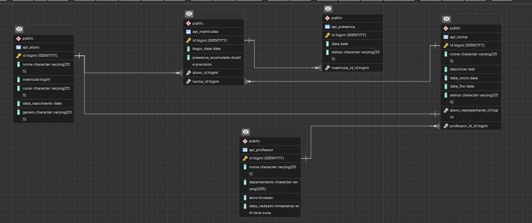

# API Projeto Django

[](https://www.python.org/downloads/)
[](https://www.djangoproject.com/)
[](https://www.sqlite.org/)
[](https://opensource.org/licenses/MIT)


## Instituições de Fomento e Parceria

[](https://www.ifb.edu.br/) 
[](https://hardware.org.br/)

## Colaborador - Daltro Oliveira Vinuto

[]( https://www.linkedin.com/in/daltro-oliveira-vinuto-520485145/ )

[-%23181717.svg?logo=github&logoColor=white)]( https://github.com/Daltro-Oliveira-Vinuto )

[]( https://www.linkedin.com/in/daltro-oliveira-vinuto-520485145/)

## Colaborador - Kyara Esteves de Sousa

[]( https://www.linkedin.com/in/kyara-esteves-de-sousa-2144219b/?originalSubdomain=br  )

[-%23181717.svg?logo=github&logoColor=white)](https://github.com/Kyara2)

[](https://lattes.cnpq.br/4642913082106691 )


## Orientador - Prof. Claudio Ulisse

[](https://www.linkedin.com/in/claudioulisse/)
[-%23181717.svg?logo=github&logoColor=white)](https://github.com/claulis)
[](http://lattes.cnpq.br/4607303092740768)

## Sumário

- [Visão Geral](#visão-geral)
- [Pacotes Utilizados](#pacotes-utilizados)
- [Estrutura do Projeto](#estrutura-do-projeto)
- [Diagrama de Banco de Dados](#diagrama-de-banco-de-dados)
- [Documentação da API](#documentação-da-api)
- [Configuração do Ambiente](#configuração-do-ambiente)
- [Deploy](#deploy)

## Visão Geral

Esta API implementa um **Sistema de Chamada de Alunos** voltado ao contexto de **instituições públicas de ensino superior**, com o objetivo de **modernizar o processo de registro de presença** e **viabilizar análises estatísticas institucionais** sobre frequência, absenteísmo e desempenho acadêmico.

O sistema está inserido no domínio da **gestão educacional**, oferecendo uma camada **backend RESTful** para o gerenciamento de **professores**, **turmas**, **alunos**, **matrículas** e **registros de presença**. A API foi projetada para ser consumida por **aplicações front-end utilizadas por docentes**, além de **dashboards de Business Intelligence (BI)** e **ferramentas de auditoria educacional**.

O principal problema abordado é a **ineficiência e a baixa confiabilidade dos métodos tradicionais de chamada**, que dificultam o acompanhamento sistemático da presença e a geração de **indicadores acadêmicos consolidados**. Ao centralizar e estruturar esses dados, a API possibilita análises como **frequência média por turma**, **histórico de presença por aluno**, **carga docente** e **identificação de padrões de absenteísmo**, apoiando a **tomada de decisão institucional baseada em dados**.

O público-alvo da solução inclui **administradores acadêmicos**, **professores** e **alunos**, cada um com **níveis de acesso distintos**. Em alto nível, a API disponibiliza funcionalidades de **cadastro**, **consulta** e **relacionamento de entidades acadêmicas**, **matrícula de alunos em turmas**, **marcação de presença** e **exposição de dados consolidados**, seguindo boas práticas de **arquitetura REST**, **segurança de acesso** e **manutenibilidade**.


## Pacotes Utilizados

## Pacotes Utilizados


| **Pacote** | **Versão** | **Descrição** |
|------------|------------|---------------|
| **Django** | >=6.0,<7.0 | Framework web principal para desenvolvimento do backend. |
| **djangorestframework** | >=3.16.1,<4.0.0 | Framework para construção de APIs RESTful com Django. |
| **drf-spectacular** | >=0.29.0,<0.30.0 | Geração automática do schema OpenAPI da API. |
| **drf-spectacular[swagger]** | >=0.29.0,<0.30.0 | Interface Swagger UI para visualização e testes da API. |
| **drf-spectacular[redoc]** | >=0.29.0,<0.30.0 | Interface ReDoc para documentação alternativa da API. |
| **djangorestframework-simplejwt** | >=5.5.1,<6.0.0 | Autenticação baseada em JSON Web Tokens (JWT). |
| **python-dotenv** | >=1.2.1,<2.0.0 | Carregamento de variáveis de ambiente a partir de arquivos `.env`. |
| **psycopg** | >=3.3.2,<4.0.0 | Driver PostgreSQL para acesso ao banco de dados em produção. |
| **dj-database-url** | >=3.0.1,<4.0.0 | Configuração do banco de dados via URL (deploy em nuvem). |
| **gunicorn** | >=23.0.0,<24.0.0 | Servidor WSGI para execução da aplicação em produção. |
| **uvicorn** | >=0.38.0,<0.39.0 | Servidor ASGI para execução assíncrona quando aplicável. |
| **django-debug-toolbar** | >=6.1.0,<7.0.0 | Ferramenta de depuração utilizada em ambiente de desenvolvimento. |
| **django-extensions** | >=4.1,<5.0 | Extensões utilitárias para desenvolvimento e manutenção do projeto. |

> **Nota:** Esses pacotes se encontram na variável `dependencies`  do arquivo `pyproject.toml` 

## Estrutura do Projeto

Abaixo podemos observar a organização dos diretórios e arquivos do projeto no formato de árvore de diretórios(comando tree) para uma clara visualização.

```
$ tree
.
├── api
│   ├── admin.py
│   ├── apps.py
│   ├── __init__.py
│   ├── migrations
│   │   ├── 0001_initial.py
│   │   ├── __init__.py
│   │   └── __pycache__
│   │       ├── 0001_initial.cpython-312.pyc
│   │       └── __init__.cpython-312.pyc
│   ├── models.py
│   ├── __pycache__
│   │   ├── admin.cpython-312.pyc
│   │   ├── apps.cpython-312.pyc
│   │   ├── __init__.cpython-312.pyc
│   │   ├── models.cpython-312.pyc
│   │   ├── serializers.cpython-312.pyc
│   │   ├── urls.cpython-312.pyc
│   │   └── views.cpython-312.pyc
│   ├── serializers.py
│   ├── tests.py
│   ├── urls.py
│   └── views.py
├── build.sh
├── manage.py
├── poetry.lock
├── projeto_django
│   ├── asgi.py
│   ├── __init__.py
│   ├── __pycache__
│   │   ├── __init__.cpython-312.pyc
│   │   ├── settings.cpython-312.pyc
│   │   ├── urls.cpython-312.pyc
│   │   └── wsgi.cpython-312.pyc
│   ├── settings.py
│   ├── urls.py
│   └── wsgi.py
├── pyproject.toml
├── README.md
└── render.yaml

7 directories, 34 files

```

## Estrutura do Projeto


A seguir está a descrição dos diretórios e módulos que compõem o projeto.


### Diretórios Principais


- **api/** 
 Contém a aplicação principal da API, responsável pela lógica de negócio, modelos de dados, serialização e endpoints REST.


- **projeto_django/** 
 Diretório de configuração global do projeto Django, incluindo definições de URLs, settings e interfaces WSGI/ASGI.


- **migrations/** 
 Armazena os arquivos de migração do banco de dados, responsáveis por versionar a estrutura das tabelas.


- **__pycache__/** 
 Diretórios gerados automaticamente pelo Python para armazenar bytecode compilado (`.pyc`).


### Arquivos e Módulos Relevantes


#### Diretório `api/`


- **admin.py** 
 Registro dos modelos da aplicação para gerenciamento via Django Admin.


- **apps.py** 
 Configuração da aplicação `api`, incluindo metadados e inicialização.


- **models.py** 
 Definição das entidades do domínio e mapeamento objeto-relacional (ORM).


- **serializers.py** 
 Serialização e desserialização dos modelos para comunicação via API REST.


- **views.py** 
 Implementação das views da API, contendo a lógica dos endpoints.


- **urls.py** 
 Mapeamento das rotas da aplicação `api` para suas respectivas views.


- **tests.py** 
 Estrutura para testes automatizados da aplicação.


#### Diretório `projeto_django/`


- **settings.py** 
 Configurações globais do projeto, incluindo banco de dados, apps instalados, middlewares e variáveis de ambiente.


- **urls.py** 
 Arquivo central de roteamento do projeto, agregando as URLs das aplicações.


- **asgi.py** 
 Ponto de entrada ASGI para execução assíncrona da aplicação.


- **wsgi.py** 
 Ponto de entrada WSGI utilizado por servidores de produção como o Gunicorn.


### Arquivos na Raiz do Projeto


- **manage.py** 
 Utilitário de linha de comando do Django para execução de tarefas administrativas.


- **pyproject.toml** 
 Arquivo de configuração do Poetry, contendo dependências, versões e metadados do projeto.


- **poetry.lock** 
 Lockfile que garante a reprodutibilidade das dependências instaladas.


- **render.yaml** 
 Arquivo de configuração do Render para provisionamento de recursos e deploy automatizado via Docker.


- **build.sh** 
 Script executado durante o processo de build no deploy, responsável por instalar dependências e preparar o ambiente.


- **README.md** 
 Documentação principal do projeto, contendo descrição, instruções e referências.


## Diagrama ER (Entidade-Relacionamento) do Banco de Dados



> **Descrição:** Diagrama ER gerado pelo pgAdmin4 para o banco de dados Postgres . Descreva as principais entidades, relacionamentos e campos críticos.

## Documentação da API

A documentação interativa está disponível em `/api/docs/` (Swagger UI) ou `/api/redoc/` (ReDoc) no ambiente de desenvolvimento.

### Endpoints Principais

| Método | Endpoint              | Descrição                          | Autenticação |
|--------|-----------------------|------------------------------------|--------------|
| GET    | `/api/items/`         | Lista todos os itens               | Opcional     |
| POST   | `/api/items/`         | Cria um novo item                  | Requerida    |
| GET    | `/api/items/{id}/`    | Recupera um item específico        | Opcional     |
| ...    | ...                   | ...                                | ...          |

> **Detalhes:** Consulte a interface Swagger para schemas de request/response, parâmetros e exemplos.

## Configuração do Ambiente

Siga os passos abaixo para configurar o ambiente local.

1. **Clone o repositório:**
   ```bash
   git clone https://github.com/usuario/projeto_api.git
   cd projeto_api
   ```

2. **Crie um ambiente virtual:**
   ```bash
   python -m venv venv
   source venv/bin/activate  # Linux/Mac
   venv\Scripts\activate     # Windows
   ```

3. **Instale as dependências:**
   ```bash
   pip install -r requirements.txt
   ```

4. **Configure as variáveis de ambiente:**
   ```bash
   cp .env.example .env
   # Edite .env com suas credenciais
   ```

5. **Aplique as migrações e inicie o servidor:**
   ```bash
   python manage.py migrate
   python manage.py runserver
   ```

## Deploy(opcional)

### Plataforma Recomendada: [Render / Railway / AWS]

1. **Prepare o `Procfile`:**
   ```
   web: gunicorn projeto.wsgi:application --log-file -
   ```

2. **Configure variáveis de ambiente** na plataforma de deploy.

3. **Execute migrações em produção:**
   ```bash
   python manage.py migrate
   ```

4. **Colete arquivos estáticos (se aplicável):**
   ```bash
   python manage.py collectstatic
   ```

> O Deploy desse projeto esta disponível no link do Render: [Deploy](https://projeto-django-kpbx.onrender.com/api/docs/swagger/)


